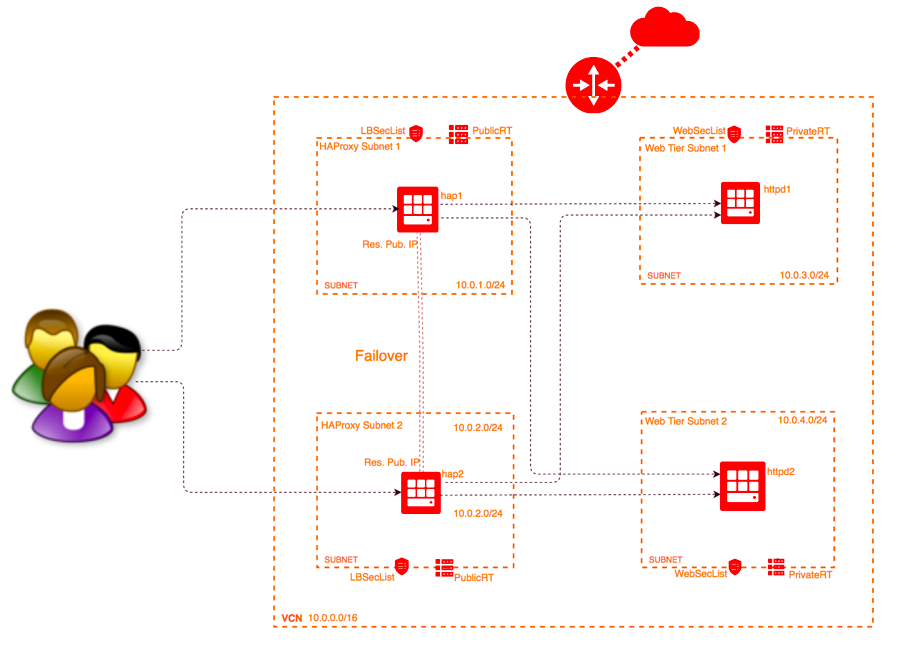

# Deploying HAProxy based High Available Active-Active LB on Oracle Cloud Infrastructure Using a Terraform

This Terraform module allows you to setup HAProxy based Load Balancer on OCI. The load balancer works in Active-Active mode. You can fully customize the load balancing configuration. For example, you can modify the SSL ciphers and protocol supported as required by your application, you can set up session persistence which is driven by the load balancer rather than application cookie based one and add any customization you like to have on the HAProxy load balancer.

## Architecture Overview


The environment consists on 2 HAProxy nodes and 2 Web Server nodes. Both the HAProxy nodes are assigned a Reserved Public IP and an additional secondary Private IP. The Reserved Public IP is assigned to the Primary Private IP in normal working mode. In the event of an HAProxy node failure, the Public IP will failover to the secondary Private IP of the other HAProxy node using Keepalived. When the failed node recovers, the Public IP will return to its original instance. Please remember that the functional Load Balancer will handle request on both the Public IPs till the failed node comes back on-line and the IP failback happens to the original node.

Keepalived is configured to use VRRP packets in uses couple of helper scripts to failover the Public IP. The helper scripts use OCI CLI and instance profile based authentication which is configured by IAM modules. Additional customization is also possible on keepalived service such as multiple health checks to ensure Keepalived correctly detect node/service failure, email notifications can be setup to alert you on a node/service failure.

## Prerequisites
1. [Download and install Terraform](https://www.terraform.io/downloads.html) (v0.11.8 or later v0.11.X versions)
2. Export OCI credentials using guidance at [Export Credentials](https://www.terraform.io/docs/providers/oci/index.html).
You must use an Admin User account to launch this terraform environment. You may update the credentials in env-vars.sh file and run it to set environment variables for this setup.
3. The tenancy used for provisoning must have service limits increased to accomodate the build. 

Refer the link [here](https://github.com/oracle/oci-quickstart-prerequisites) for detailed instructions on setting up terraform.

## Update env-var.sh file with OCI credentials
```
export TF_VAR_tenancy_ocid=
export TF_VAR_user_ocid=
export TF_VAR_compartment_ocid=

### OCI API keys
export TF_VAR_private_key_path=/
export TF_VAR_fingerprint=

### Region and Availability Domain
export TF_VAR_region=
export TF_VAR_availability_domain=1

### Public/Private keys used on the instance
### Replace with your key paths
export TF_VAR_ssh_public_key=$(cat /path/to/pubKey)
export TF_VAR_ssh_private_key=$(cat /path/to/privatekey)
  ```


## Update terraform.tfvars 

This is where you setup values to the customizable variables for this deployment.

| Argument                   | Description                                                                                                                                                                                                                                                                                                                                                       |
| -------------------------- | ----------------------------------------------------------------------------------------------------------------------------------------------------------------------------------------------------------------------------------------------------------------------------------------------------------------------------------------------------------------- |
| compartment_name           | Name of the compartment where the resources are to be created. This is used to create IAM policy for the Dynamic Group.                                                                                                                                                                                                                                                                                                                              
| region                     | Region to be used.                                                                                                                                                                                                                                                                                                                               
| AD                         | Availability Domain for deployment. Setting AD = ["1"] deploys infrastructure in single availability domain (Availabilty domain 1 of the tenancy in this case) and AD = ["1","2"] deploys infrastructure in multiple ADs (Avilability domains 1 and 2 of the tenancy in this case). |
| vcn_cidr                   | CIDR block of the VCN (Virtual Cloud Network) to be created.                                                                                                                                                                                                      
| vcn_dns_label              | DNS Label of the VCN (Virtual Cloud Network) to be created.                                                                                                                                                                                                       
| vcn_display_name           | Name of the VCN (Virtual Cloud Network) to be created.                                                                                                                                                                                                                                                                                                                    
| timezone                   | Timezone of compute instances.
| compute_boot_volume_size_in_gb  | Size of boot volume (in gb) of the instances.                                                                                                                                                                                                       
| compute_instance_user           | Login user for instances.                                                                                                                                                                                                       
| lb_hostname_prefix              | Hostname prefix to for LB nodes.                                                                                                                                                                                                       
| lb_instance_count               | Number of HAProxy LB nodes to be created.                                                                                                                                                                                                       
| lb_instance_shape               | Haproxy Load balancer instance shape. Tested with 2 LB nodes only.                                                                                                                                                                                                 
| web_instance_count              | Number of Web Server instances to be created.                                                                                                                                                                                                       
| web_instance_shape              | Web Tier instance shape.                                                                                                                                                                                                   
| web_hostname_prefix             | Hostname prefix for Web Tier nodes.                                                                                                                                                                                                       

## Sample terraform.tfvar file 

```hcl
# Compartment name
compartment_name = "JayL"

# Region
region = "eu-frankfurt-1"

# AD (Availability Domain to use for creating infrastructure) 
AD = ["1","2"]

# CIDR block of VCN to be created
vcn_cidr =  "10.0.0.0/16"

# DNS label of VCN to be created
vcn_dns_label = "hap"

# Display name for VCN
vcn_display_name = "hapvcn"

# Operating system version to be used for application instances
linux_os_version = "7.2"

# Timezone of compute instance
timezone = "GMT"

# Size of boot volume (in gb) of the instances
compute_boot_volume_size_in_gb = "50"

# Login user for instances
compute_instance_user = "opc"

# Hostname prefix to define name of LB nodes
lb_hostname_prefix = "lb"

# Number of HAProxy LB nodes to be created
lb_instance_count = "2"

# Haproxy Load balancer instance shape
lb_instance_shape = "VM.Standard2.1"

# Web tier Instance count
web_instance_count = "2"

# Web Tier instance shape
web_instance_shape = "VM.Standard2.1"

# Hostname prefix for Web Tier nodes
web_hostname_prefix = "web"
```

### How to use this module

1) Download or clone the modules to your local machine and go to the module directory.

  ```
  cd HAProxy-On-OCI
  ```

2) Update **env-vars.sh** with the required information. This file defines environment variables with credentials for your Oracle Cloud Infrastructure tenancy.

3) Update **terraform.tfvars** with the inputs for the architecture that you want to build. A working sample of this file is available in previous section and can be copied to launch an environment.

4) Set environment variables by running **source env-vars.sh** on your UNIX system or by running **env-vars.ps1** on your Windows system.

  ```
  $ source env-vars.sh
  ```

5) Initialize Terraform. This will also download the latest terraform oci provider.

  ```
  $ terraform init
  ```

6) Run terraform apply to create the infrastructure:

  ```
  $ terraform apply
  ```

When you’re prompted to confirm the action, enter **yes**.

When all components have been created, Terraform displays a completion message. For example: Apply complete! Resources: 28 added, 0 changed, 0 destroyed.

7) If you want to delete the infrastructure, run:

  ```
  $ terraform destroy
  ```

When you’re prompted to confirm the action, enter **yes**.

## Disclaimer
This is my personal GitHub project, the ideas expressed here do not represent my employer's point of view... Likewise the exact opposite is also definitely true!
